<h1 align="center">🐾 MofuPaw · 萌爪</h1>
<p align="center">
  <strong>一只毛茸茸的 AI 桌面宠物，住在你的 Mac 里</strong>
</p>
<p align="center">
  <em>一只聪明、可爱的 AI 电子宠物 🐱</em>
</p>
<p align="center">
  <a href="README.md">🇺🇸 English</a> ·
  <a href="#-什么是-mofupaw">🎮 什么是 MofuPaw</a> ·
  <a href="#-功能亮点">✨ 功能亮点</a> ·
  <a href="#-快速开始">🚀 快速开始</a>
</p>

<p align="center">
  
  
  
  
</p>

---

## 🎮 什么是 MofuPaw？

**MofuPaw（萌爪）** 是一款**原生 macOS 桌面宠物应用** —— 一只小小的动画伙伴，悬浮在你的桌面上，会四处走动、打盹小憩、对你的点击做出反应，甚至能**用 AI 和你聊天**。

> *Mofu = 毛茸茸、软绵绵的，撸到可爱小动物时的那种手感*
> *Paw = 它在你桌面上留下的小爪印*

这是一款用 Swift 从零为 macOS 打造的现代**电子宠物**，具备完整的 AI 能力。不用 Electron，不用网页套壳，纯原生 Swift，在每一块 Retina 屏幕上都清晰完美。

<p align="center">
  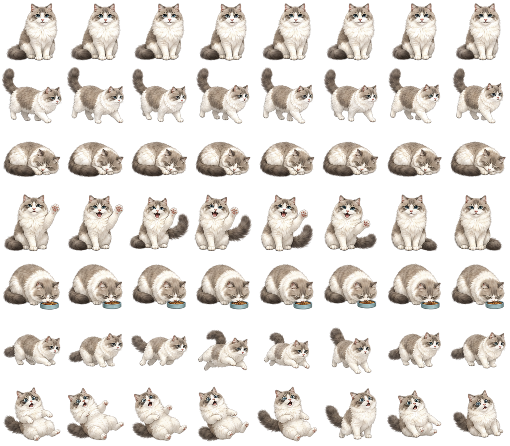
  <br>
  <em>默认猫咪精灵图 — 7 种状态，每种 8 帧动画</em>
</p>

<p align="center">
  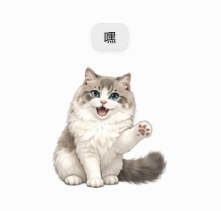
</p>

---

## ✨ 功能亮点

### 🧠 AI 智能伙伴

你的宠物不只是一个动画精灵——它是一个由大语言模型驱动的**会思考的伙伴**。

- **实时聊天** — 通过内置聊天面板与宠物对话，支持流式响应
- **多 AI 提供商** — 支持 OpenAI、Anthropic Claude 及任何 OpenAI 兼容 API
- **四种性格** — 温柔 🌸 / 活泼 ⚡ / 安静 🌙 / 调皮 😈
- **长期记忆** — 你的宠物会记住你的喜好、昵称和过去的对话
- **情绪感知** — 追踪 8 种情绪状态，根据你的情绪调整行为
- **主动对话** — 宠物会根据里程碑、情绪变化和日常习惯主动找你聊天

<p align="center">
  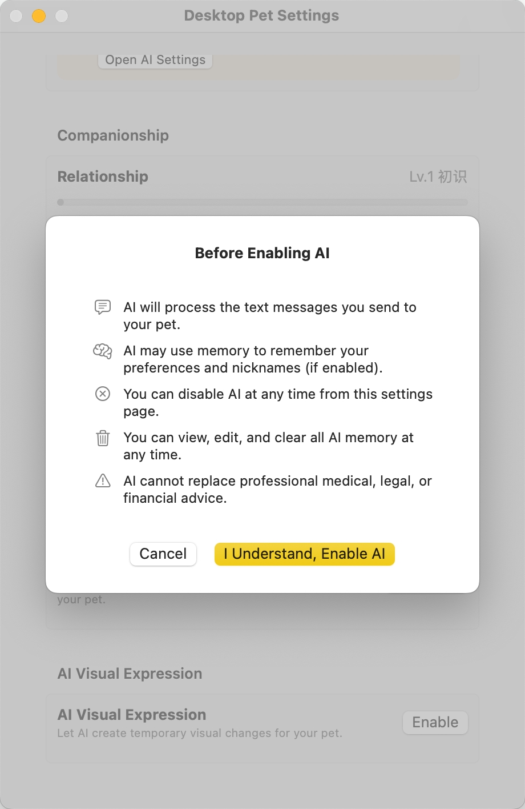
  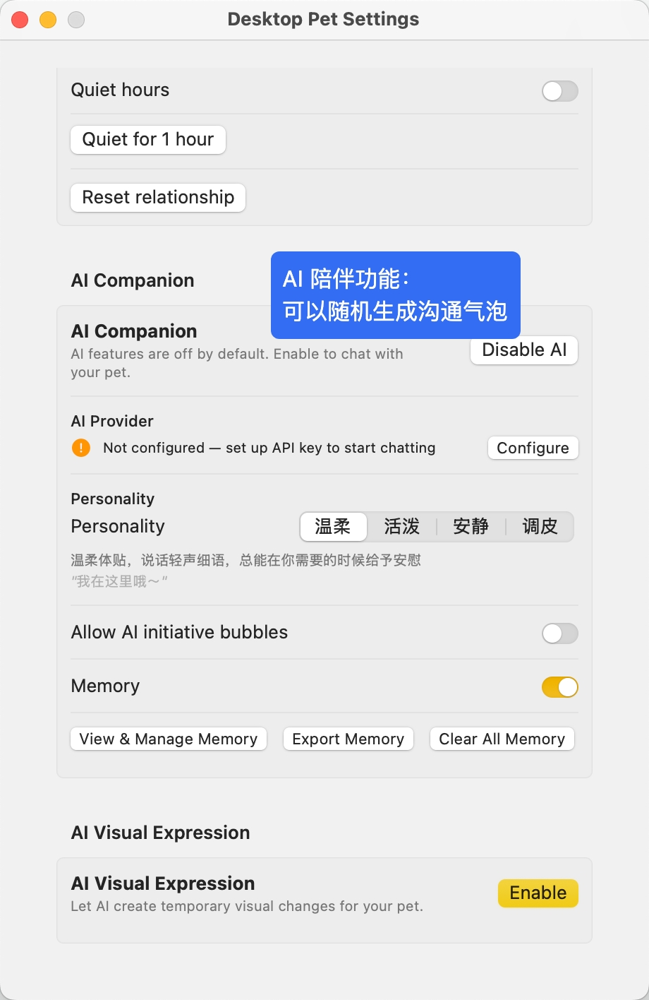
</p>

### 🎨 AI 视觉生成

用 AI 图像生成给宠物换上全新造型！

- **多平台支持** — MiniMax、阿里云、硅基流动、腾讯云、OpenAI 兼容 API
- **视觉覆盖** — 生成的图片会临时改变宠物外观
- **身份一致性** — AI 在生成时保持宠物的角色特征
- **用户反馈学习** — 系统会根据你的偏好持续优化

<p align="center">
  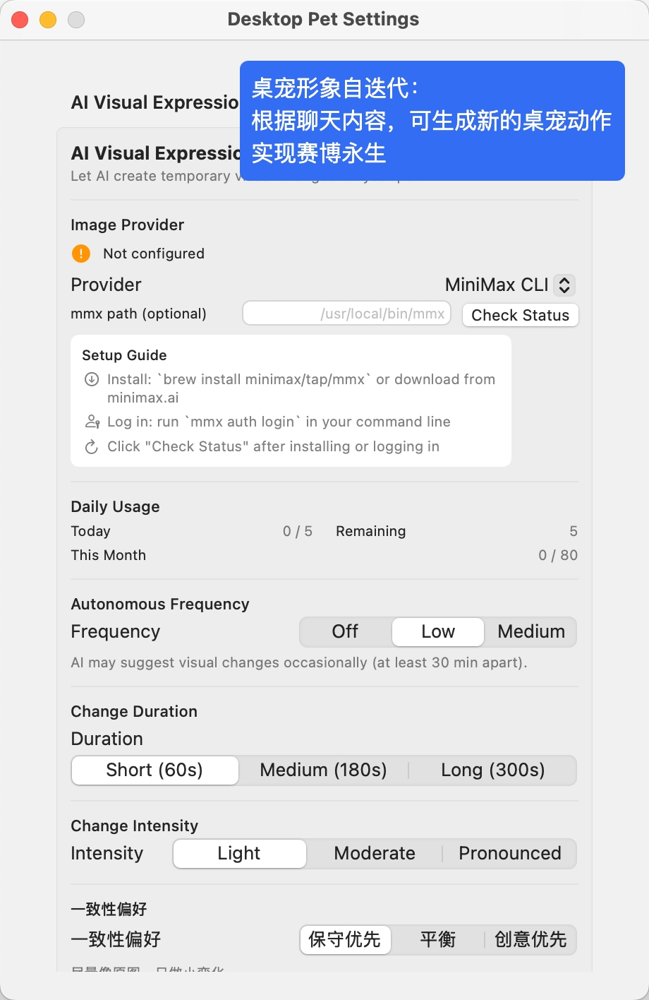
</p>

### 💕 陪伴系统

你和宠物的关系会通过**五个亲密度等级**逐步升温：

| 等级 | 名称 | 所需点数 | 解锁内容 |
|------|------|----------|----------|
| 1 | 初识 | 0 | 基础互动 |
| 2 | 熟悉 | 100 | 更多对话选项 |
| 3 | 亲近 | 250 | 更深入的交流 |
| 4 | 信赖 | 500 | 特殊互动 |
| 5 | 默契 | 900 | 完全陪伴 |

### 🫧 互动气泡系统

你的宠物通过智能的、有情境感知的对话气泡与你沟通：

- **情境语句** — 开心、饥饿、疲惫、刚睡醒时都有不同的话
- **互动选择** — AI 生成的多选项互动提示（喂食、玩耍、抚摸、聊天）
- **微型对话** — 快速情境互动，带有多选项回应
- **优先级系统** — 重要消息（比如"我饿了！"）永远不会被淹没

<p align="center">
  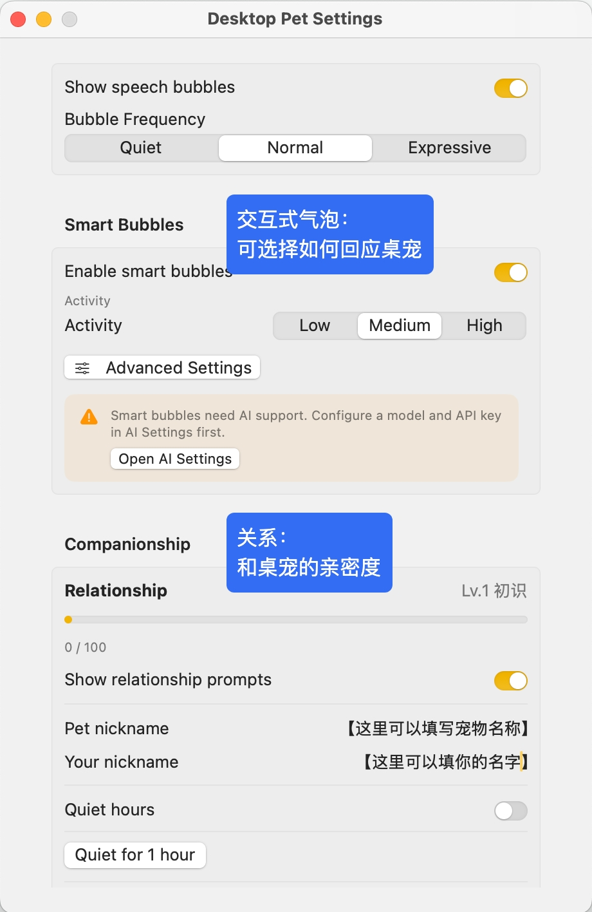
</p>

### 🎭 宠物引擎

完全数据驱动的宠物模拟引擎：

- **7 种状态** — 待机、行走、睡觉、开心、进食、跳跃、拖拽
- **心情模拟** — 心情、饥饿度、体力随时间自然变化
- **时间感知** — 行为随早中晚自动变化
- **自动入睡** — 你离开时宠物会自己打瞌睡
- **随机待机行为** — 加权行为调度，呈现自然的生命感

<p align="center">
  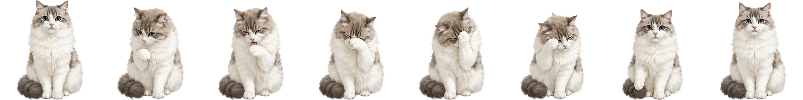
  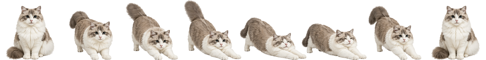
</p>

### 📦 宠物图鉴 & 自定义宠物

- **图片导入** — 把任意图片变成桌面宠物
- **Petdex 格式** — 标准化的宠物包格式，方便分享
- **.pet 包** — 导出并分享完整的宠物包
- **动作包** — 模块化内容包，为现有宠物添加新动画
- **内容包** — 用对话包和性格包扩展宠物能力

<p align="center">
  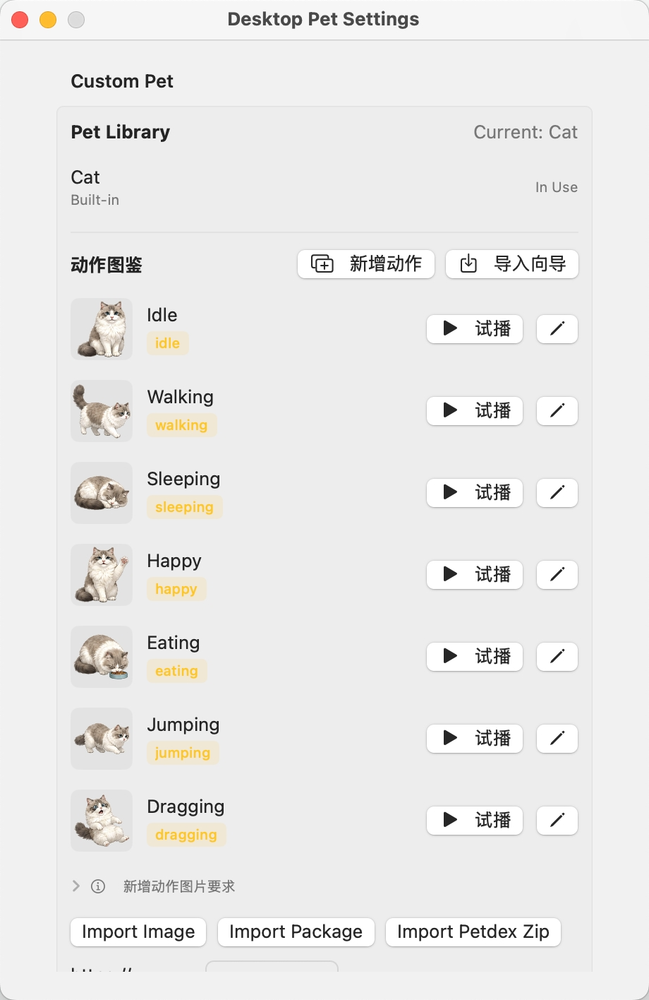
  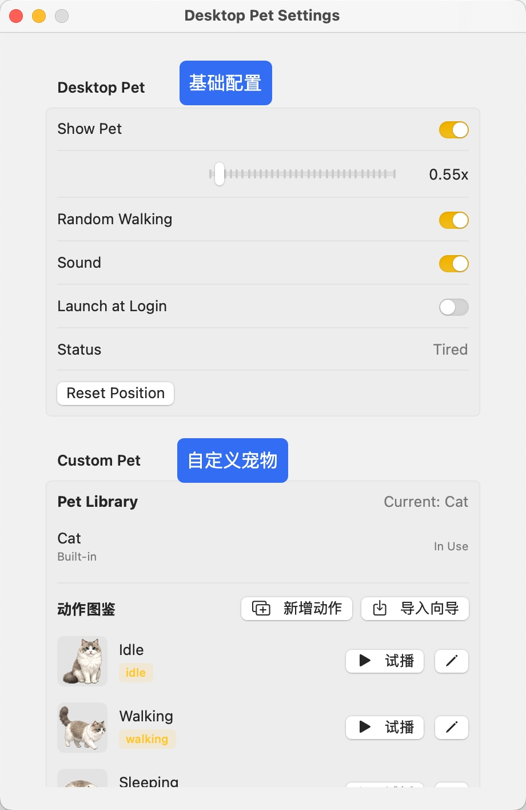
</p>

### 🖥️ 桌面集成

- **窗口置顶** — 悬浮在所有窗口之上，不抢夺焦点
- **透明穿透** — 点击只在宠物身上生效，其余区域穿透
- **自由拖拽** — 把宠物拖到屏幕任何位置
- **位置记忆** — 记住你上次放置的位置
- **多显示器** — 支持多屏幕环境
- **菜单栏控制** — 通过 🐾 菜单栏图标完全掌控

<p align="center">
  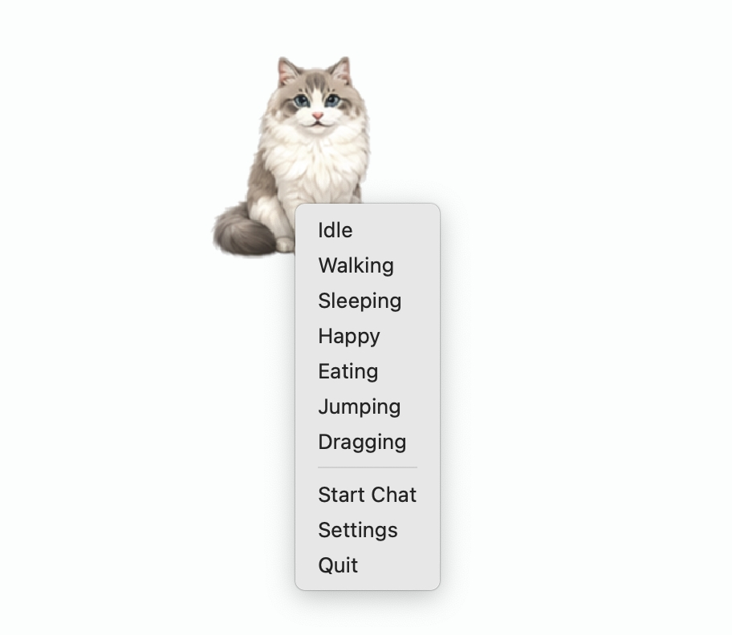
</p>

### ⌨️ 进阶功能

- **桌面空间感知** — 宠物对附近的窗口和屏幕边缘做出反应
- **输入同步** — 可选地跟踪键鼠活动，让宠物对你的工作做出反应
- **外部 API** — Unix Socket IPC，支持外部工具集成
- **音效反馈** — 点击、抚摸、喂食时有声音反馈
- **开机自启** — 跟随 macOS 自动启动

---

## 🚀 快速开始

### 环境要求

- **macOS 13.0** (Ventura) 或更高版本
- **Xcode 15+** 及 Swift 6 工具链
- （可选）AI API 密钥，用于聊天和视觉生成功能

### 从源码构建

```bash
# 克隆仓库
git clone https://github.com/your-username/MofuPaw.git
cd MofuPaw

# 构建
swift build

# 运行
swift run MofuPaw
```

### 打包发布

```bash
./Scripts/package_release.sh
```

生成独立的 `.app` 应用包，可直接拖入 `/Applications` 使用。

---

## ⚙️ 配置指南

### AI 设置

1. 点击菜单栏 🐾 图标 → **设置**
2. 进入 **AI 设置** 面板
3. 选择提供商（OpenAI / Anthropic / 自定义）
4. 输入 API 密钥（安全存储在 macOS 钥匙串中）
5. 为你的宠物选择一种性格

### 图像生成设置

1. 设置 → **AI 视觉** 面板
2. 选择图像生成提供商
3. 配置 API 凭据
4. 现在你的宠物可以通过 AI 生成变装啦！

---

## 🏗️ 项目架构

MofuPaw 采用简洁的面向协议架构，纯 Swift 编写：

```
MofuPaw/
├── App/                 # 应用生命周期、协调器、命令
├── PetCore/             # 状态机、心情引擎、行为调度
├── PetRendering/        # 精灵图渲染、动画播放器
├── PetAssets/           # 宠物定义、动画片段
├── PetWindow/           # 浮动面板、拖拽、点击穿透
├── Bubble/              # 气泡引擎、调度
├── InteractiveBubble/   # AI 驱动的互动提示
├── AICompanion/         # 聊天引擎、记忆、性格、情绪
├── AIVisualAction/      # 视觉动作调解
├── AIVisualGeneration/  # 图像生成提供商
├── Companionship/       # 亲密度系统、微型对话
├── PetLibrary/          # 宠物导入导出、自定义宠物
├── Petdex/              # Petdex 格式支持
├── ActionPacks/         # 模块化动画包
├── AdvancedFeatures/    # 桌面空间、外部API、输入同步
├── Sound/               # 音效反馈
├── Preferences/         # 用户偏好持久化
└── MenuBar/             # 状态栏 UI
```

**核心设计模式：**
- **协调器模式** — 中央 `AppCoordinator` 路由所有命令
- **MVVM + SwiftUI** — 视图绑定 `ObservableObject` 视图模型
- **依赖注入** — `AppDependencyContainer` 组装一切，无全局单例
- **事件驱动** — `PetEvent`、`CompanionEvent`、`BubbleTrigger` 驱动行为
- **可插拔提供商** — AI、图像生成、内容包均通过注册表管理

---

## 🧪 测试

```bash
# 运行所有测试
swift test

# 运行特定测试套件
swift test --filter DesktopPetUnitTests
swift test --filter DesktopPetValidation
```

---

## 🤝 参与贡献

欢迎各种形式的贡献！

1. **Fork** 本仓库
2. **创建** 功能分支 (`git checkout -b feature/amazing-feature`)
3. **提交** 更改 (`git commit -m '添加超棒功能'`)
4. **推送** 到分支 (`git push origin feature/amazing-feature`)
5. **发起** Pull Request

### 贡献方向

- 🎨 新的宠物设计和精灵图
- 🗣️ 更多性格配置
- 🌍 国际化 / 多语言支持
- 🧩 新内容包（动作、对话、性格）
- 🐛 Bug 修复和性能优化
- 📖 文档改进

---

## 🙏 致谢

- **[Petdex](https://github.com/crafter-station/petdex)** — 社区驱动的公共宠物精灵图库（[petdex.crafter.run](https://petdex.crafter.run)）。MofuPaw 支持导入 Petdex 包（`.zip`），但不内置、不分发、不修改任何 Petdex 资源。所有 Petdex 资源均由用户运行时下载，遵循其原始授权。

---

## 📄 开源协议

本项目基于 **知识共享署名-非商业性使用-相同方式共享 4.0 国际协议 (CC BY-NC-SA 4.0)** 开源 — 详见 [LICENSE](LICENSE) 文件。

这意味着你可以自由分享和改编本项目，但**不得用于商业目的**，且衍生作品必须以相同协议发布。

---

<p align="center">
  用 ❤️ 和 Swift 打造<br>
  <sub>喜欢 MofuPaw？给个 ⭐ 吧！</sub>
</p>
